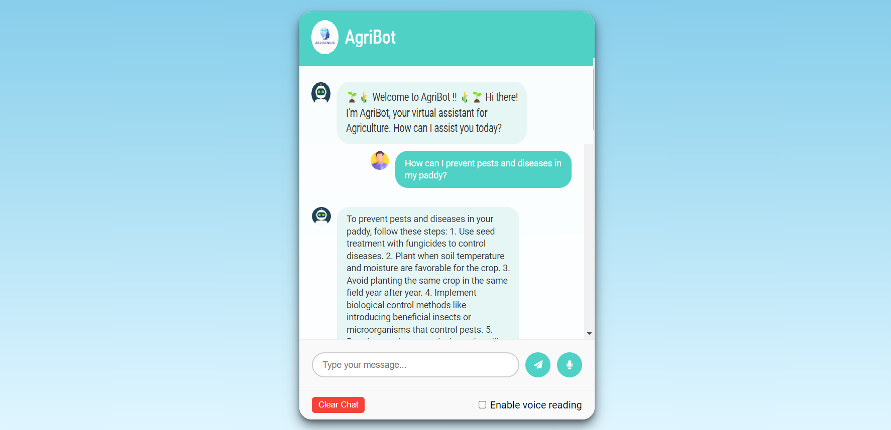

# AgriBot: AI-Powered Agriculture Chatbot for Farmers


## Project Overview
AgriBot is an AI-powered Python web application designed to assist farmers by providing quick and accurate agricultural information. Using a Retrieval-Augmented Generation (RAG) model, AgriBot intelligently fetches relevant data from a wide range of agricultural websites and PDF resources. It then processes and delivers detailed, personalized responses to user queries, enabling farmers to access expert advice and guidance.

## Features

- Fetches content from specified agricultural websites.
- Extracts text from PDF documents.
- Initializes a vector store for efficient information retrieval.
- Uses a Retrieval QA chain with a language model to answer agriculture-related queries.
- Provides an intuitive web interface for easy interaction.

## Installation

Run the following Commands.

`STEP 1` - Creating virtual enviroment :
To do so:-
```bash
  pip install virtualenv
```
```
  virtualenv env
  .\env\Scripts\activate.ps1
```
----
`STEP 2` - Cloning the Repository :
```
    git clone <link>
    cd AgriBot
```
----
`STEP 3` - Installing all the Dependancies :

```
    pip install -r requirements.txt
```
---
`STEP 4` - Run the flask web application
```
    python app.py
```
---
`STEP 5` - Open Web-Browser (Chrome) and navigate to `http://127.0.0.1:5000` to use this web-application.

---
`STEP 6` - Ask questions related to agriculture in the provided input field.

---


## Additional Notes

- The language model used is meta-llama/Llama-2-70b-chat-hf.
- The application uses the Together API for LLM services.
- Add your own Together API key in the chat2.py file.
  
```
llm = Together(
	model="meta-llama/Llama-2-70b-chat-hf",
	max_tokens=512,
	temperature=0.1,
	top_k=1,
	together_api_key="YOUR_Together_API_KEY"
)
```

- The requirements.txt should include all necessary packages such as Flask, requests, PyPDF2, langchain, chroma, and any other dependencies required by your project.


### 😊 Thankyou !! ✨
